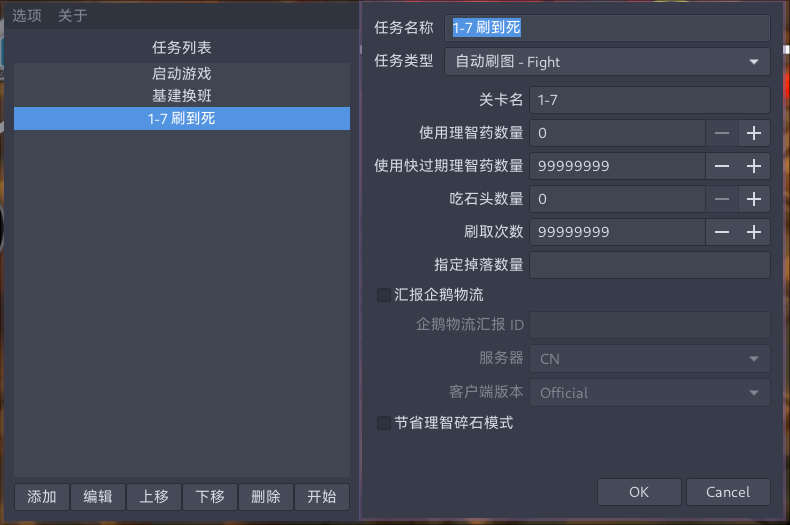

# Maa-Gtk

适用于 MaaAssistantArknights 的简单 PyGtk 界面。

- 需要自己安装 MaaAssistantArknights 并且能够知道装到了哪里
- 需要自己安装 ADB 套件并且能够在 PATH 里面找到

满足上述条件之后，直接通过 `python main.py` 启动即可。

初次运行请点击 `选项` > `设置` 完成连接测试，如果连接成功则没有问题。

